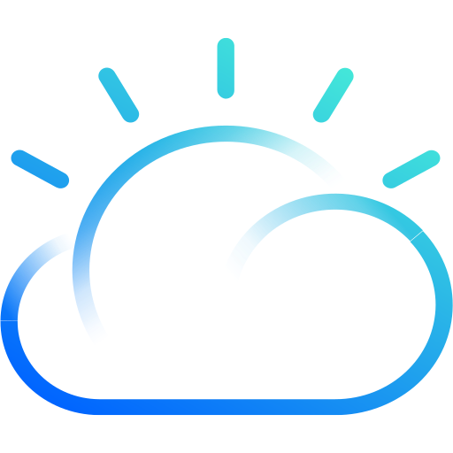

# Ángel Fernández Ríos

## About me
After finishing my grade in Telecom Engineering, I started working as a software consultant, where I discovered what monitoring tools are and what value they could bring to an organization. After years deploying and customizing solutions to serve specific needs, I figured out that new paradigms (virtualization, containerization, cloud journeys, automation) force organizations to have complex ecosystems in constant evolution, so a more holistic approach is needed when it comes to monitoring. That is when the concept of 'Observability Platform' appears, where a combination of tools provide full visibility of all technologic layers the simplest way possible.

I work to design the best observability platform possible for either on-premise, private cloud, public cloud or hybrid cloud systems.

I like to work with on open-source solutions, but leveraging as well any valuable functionality offered by propietary solutions or the cloud providers themselves.

## My Tech Stack
### Observability tools 

  

    <kbd>
        
        
        
        
        
        
    </kbd>
  

### Languages and Tools

  

    <kbd>
      <kbd>Infrastructure & Cloud</kbd>
       
       
        
        
        
        
        
    </kbd>
    <kbd>
      <kbd>Source Code Management</kbd>
       
       
        
        
        
    </kbd>
    <kbd>
      <kbd>Project Management</kbd>
       
       
        
        
    </kbd>
     
     
    <kbd>
      <kbd>Operating Systems</kbd>
       
       
        
        
    </kbd>
    <kbd>
      <kbd>Languages / Scripting</kbd>
       
       
        
        
    </kbd>
  

### My badges

  

    <kbd>
        
        
        
    </kbd>
  

## What can you expect from this repo?
I am far for being a pure software developer, so in this repo you will find my particular bits of information or code for testing specific technologies or use cases. Some examples:
- Custom Prometheus Exporters
- Small scripts or programs for testing environment (e.g: script to simulate metrics from a technology)
- Some relevant notes, schemas, o documentation 
