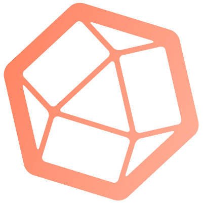
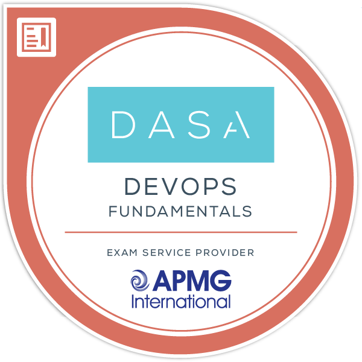

# Ángel Fernández Ríos

**`Cloud Observability Architect`**

---

### My Tech Stack

  

    <kbd>
        
        
        
        
        
        
    </kbd>
  

### Languages and Tools

  

    <kbd>
      <kbd>Infrastructure & Cloud</kbd>
       
       
        
        
        
        
    </kbd>
    <kbd>
      <kbd>Source Code Management</kbd>
       
       
        
        
        
    </kbd>
    <kbd>
      <kbd>Project Management</kbd>
       
       
        
        
    </kbd>
     
     
    <kbd>
      <kbd>Operating Systems</kbd>
       
       
        
        
    </kbd>
    <kbd>
      <kbd>Languages / Scripting</kbd>
       
       
        
        
    </kbd>
  

### My badges

  

    <kbd>
        
        
        
    </kbd>
  

